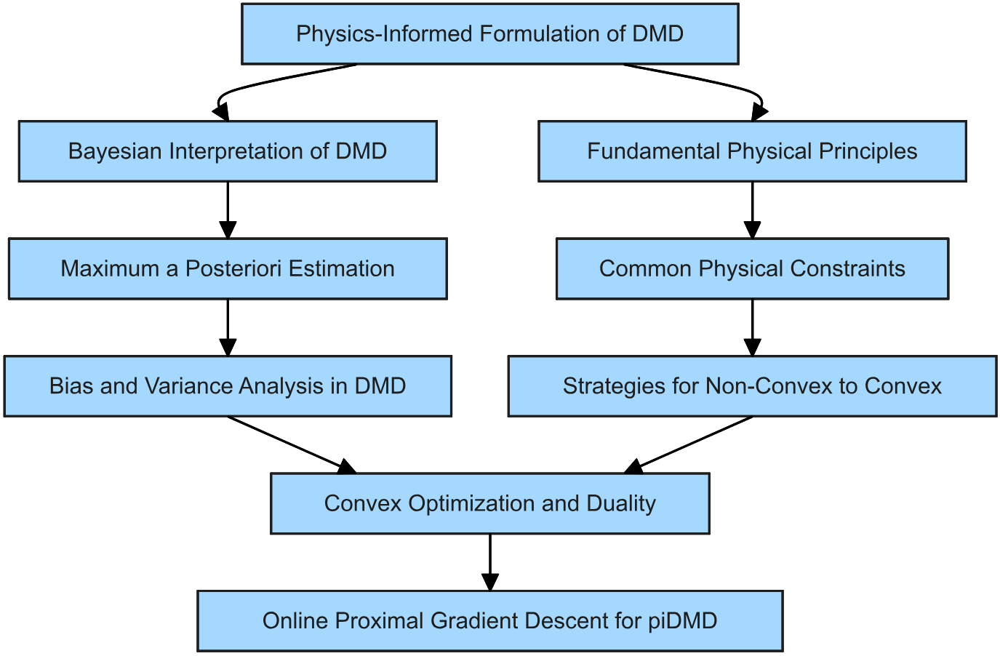
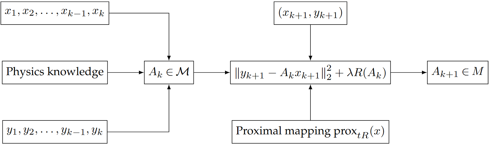

### Data and Code for Images and Algorithms in the Paper "Online Physics-Informed Dynamic Mode Decomposition: Theory and Applications"

If you're interested in learning more about my research, a brief introduction of **my personal research homepage** can be found on [GitHub](https://github.com/Chen861368/Personal-Research-Path).

---
#### Introduction
This document provides a detailed description of the data, images, and algorithms used in the paper "Online Physics-Informed Dynamic Mode Decomposition: Theory and Applications". The purpose is to ensure reproducibility and facilitate a deeper understanding of the methodologies employed.
The main framework of the paper is shown in the figure below:

<p align="center">  </p>

By formulating the online system update in the paper as a convex optimization problem, we applied the following method for solving it:

<p align="center">
  
</p>


### Updates Based on Reviewer Comments

In response to the first round of review comments, we have added several new examples. The corresponding code for these examples has been placed in a new repository titled `banach-Here’s-the-code-modified-according-to-the-reviewer’s-comments`. The filenames within the repository are descriptive and indicate the specific example they correspond to.

With the exception of the ‘Cylinder Flow’ example, the data for all other examples can be directly generated using the provided code, so there is no need to upload additional data. For the ‘Cylinder Flow’ example, the data can be downloaded independently from [https://www.databookuw.com/](https://www.databookuw.com/).

# Performance and Robustness Testing of Online Physics-Informed DMD

To test the robustness of the method against noise, **25% non-stationary Gaussian white noise** was added to all training data, while keeping the test data noise-free to evaluate the predictive performance of each algorithm. During the prediction phase, the **DMD modal decomposition method** was used, utilizing eigenvalues and eigenvectors to predict noise-free test data.

Since all physical laws are approximations of reality with varying degrees of precision or serve to simplify model complexity, the implementation on GitHub treats **physical constraints** primarily as tools to enhance prediction accuracy rather than as strict representations of the system's physical nature. Through the provided examples, the repository explores the predictive capabilities of the OPIDMD algorithm in **noisy environments**. Results from multiple systems demonstrate that the OPIDMD algorithm has a clear advantage in **short-term prediction accuracy**.

The **coefficient of determination \( R^2 \)** was used as the primary metric for evaluating prediction accuracy. The \( R^2 \) value measures how well the predicted data matches the true data, with values closer to 1 indicating better predictive performance. 

### Key Findings

- **Generalization Performance**: OPIDMD demonstrates strong generalization performance in **high-dimensional nonlinear systems** with limited sample data.
- **Performance Comparison**: The repository includes tables summarizing the performance of OPIDMD and other algorithms, showcasing their prediction accuracy under varying noise and constraints.

| **System**          | **True DMD** | **Exact DMD** | **piDMD** | **OPIDMD** | **Online DMD**              |
|----------------------|--------------|---------------|-----------|------------|-----------------------|
| 2D Advection         | 0.920        | 0.808         | 0.818     | 0.830      | `-9.73×10^{196}`     |
| Schrödinger Equation | 0.915        | 0.808         | 0.838     | 0.885      | 0.755                |
| Advection-Diffusion  | 0.870        | 0.705         | 0.723     | 0.846      | `-2.56×10^{204}`     |
| Cylinder Flow        | 0.941        | 0.938         | 0.935     | 0.935      | `-1.43×10^{39}`      |
| Lorenz System        | 0.950        | 0.066         | 0.062     | 0.991      | 0.066                |

### Constraints and Predictive Performance

The GitHub documentation details the impact of **various constraints** on prediction accuracy across different systems. Key constraints include:

- **OGD** (Online Gradient Descent)
- **\(l_1\) Norm**
- **\(l_2\) Norm**
- **Low Rank**
- **Symmetric** and **Tri-Diagonal Structures**

| **Constraint**        | **2D Advection** | **Schrödinger Equation** | **Advection Diffusion** | **Cylinder Flow** | **Lorenz System** |
|------------------------|------------------|--------------------------|--------------------------|-------------------|-------------------|
| OGD                   | 0.821            | 0.5036                   | 0.846                   | 0.935             | 0.237             |
| \(l_1\) Norm          | 0.813            | 0.874                    | 0.846                   | 0.935             | 0.235             |
| \(l_2\) Norm          | 0.821            | 0.884                    | 0.846                   | 0.935             | 0.235             |
| Low Rank              | 0.814            | 0.885                    | 0.846                   | -                 | 0.235             |
| Symmetric             | 0.830            | 0.846                    | 0.842                   | 0.849             | -                 |
| Circulant             | -                | 0.861                    | -                        | -                 | -                 |
| Tri-Diagonal          | -                | -                        | -                        | -                 | 0.991             |

### Additional Notes

Due to the unique dynamic characteristics of each system, the selection of physical constraints must consider their impact on **prediction accuracy**. General constraints like OGD, \(l_1\), and \(l_2\) norms are applied to all systems to ensure broad applicability, while more targeted constraints such as **symmetry** or **tri-diagonal structures** are used in systems with similar properties.


#### Code Dependencies
This research integrates various algorithms, including OPIDMD, piDMD, and Streaming DMD, by referencing open-source libraries such as PyDMD and online DMD codebases. We are grateful for these open-source contributions, and we have acknowledged and cited them appropriately in the paper. These libraries provide robust implementations of dynamic mode decomposition methods, which significantly facilitated our comparative analysis and validation.

- **PyDMD**: A Python package for Dynamic Mode Decomposition, which offers a comprehensive set of tools for standard and extended DMD algorithms.
- **Online DMD**: Implementations of online variants of DMD, which are crucial for real-time analysis and updates.

To use these libraries, ensure they are installed in your environment. For example, you can install PyDMD using:
```bash
pip install pydmd
```

#### Conclusion
This document provides an overview of the data, images, and algorithms used in the paper "Online Physics-Informed Dynamic Mode Decomposition: Theory and Applications". By sharing these details, we aim to promote transparency, reproducibility, and further advancements in the field. We express our gratitude to the developers of the open-source libraries that made this research possible.


